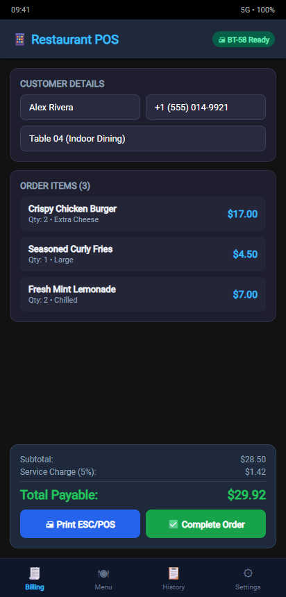
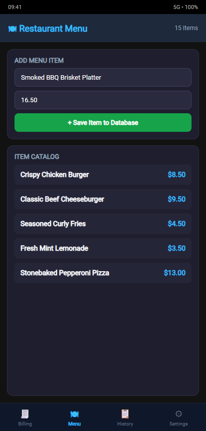
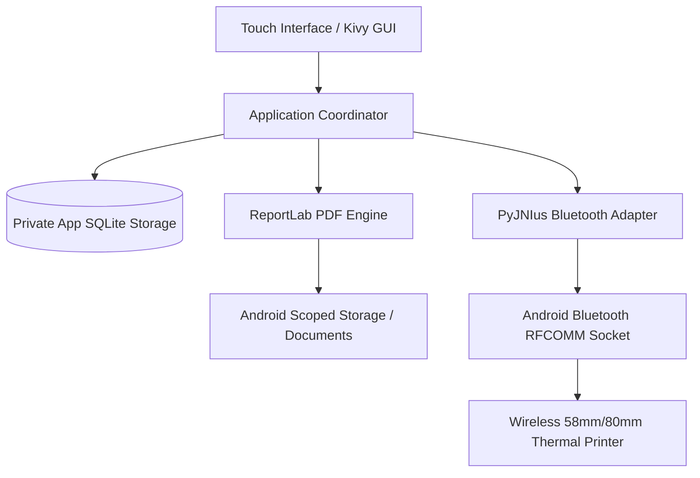

# Restaurant POS — Android & Mobile

[](https://www.python.org/)
[](https://kivy.org/)
[](https://www.android.com/)
[](printer.py)
[](https://www.sqlite.org/)
[](LICENSE)

A mobile Point of Sale (POS) application engineered in **Python** using **Kivy** and packaged for **Android** via **python-for-android / Buildozer**. Features offline SQLite transaction handling, 80mm/58mm thermal receipt PDF rendering, and direct Android Bluetooth ESC/POS printing over RFCOMM sockets via PyJNIus.

---

## Key Capabilities

- **Mobile Counter & Tabletop Billing**: Swift cart selection, customizable modifier lines, automatic delivery/service surcharges, and instant total calculations.
- **Wireless Bluetooth ESC/POS Printing**: Native Android Bluetooth RFCOMM socket interface that connects directly to portable 58mm/80mm thermal printers (e.g., Goojprt, Milestone, Xprinter, Zebra) with zero cloud drivers.
- **Embedded Document Engine**: Programmatic ReportLab compiler generating thermal PDF receipts directly into Android Scoped Storage (`Documents/RestaurantPOS/Receipts/`).
- **Dynamic Catalog CRUD**: Add, edit, price, and catalog menu items on the fly with real-time substring filtering.
- **Automated Operations Lifecycle**: Daily transaction archiving with configurable data retention rules to optimize SQLite performance on mobile flash storage.
- **Automated GitHub Actions CI/CD**: Fully automated Buildozer container pipeline compiling production `.apk` artifacts directly from source on every release tag.

---

## Visual Showcase

| Mobile Sales & Billing Screen | Mobile Menu Catalog |
| :---: | :---: |
|  |  |
| *Real-Time Cart, Taxes & Bluetooth Print* | *Mobile Item Intake & Live Pricing* |

---

## Architecture & Hardware Pipeline



---

## Technical Specifications

| Component | Technology | Role |
| :--- | :--- | :--- |
| **Language** | Python 3.11 | Core business logic and database queries |
| **GUI Framework** | Kivy 2.3.1 | Cross-platform mobile touch widgets and canvas rendering |
| **Hardware Bridge** | PyJNIus (`p4a`) | Android Java Native Interface for Bluetooth Device discovery and socket I/O |
| **Receipt Rendering**| ReportLab 4.2+ | Formatted 80mm thermal receipts with store logos |
| **File Picker** | Plyer 2.1.0 | Native Android SAF gallery picker for store logo selection |
| **Packaging** | Buildozer / P4A | Automated Android Gradle toolchain compiling release APKs |

---

## Quickstart & Setup

### Desktop Testing & Development

Run the mobile layout locally on desktop before deploying to devices:

1. **Clone the repository:**
   ```bash
   git clone https://github.com/Haroon-World/RestaurantPOS_Android.git
   cd RestaurantPOS_Android
   ```

2. **Create and activate a virtual environment:**
   ```bash
   python -m venv .venv
   .\.venv\Scripts\activate
   ```

3. **Install dependencies:**
   ```bash
   pip install -r requirements.txt
   ```

4. **Run the Kivy application:**
   ```bash
   python main.py
   ```

---

## Android APK Compilation

The repository includes a configured `buildozer.spec` and automated GitHub Actions workflow (`.github/workflows/build-apk.yml`).

To build locally using Buildozer (requires Linux or WSL2):

```bash
# Install Buildozer
pip install buildozer

# Build debug APK
buildozer android debug
```

Compiled APK artifacts will be placed in the `bin/` directory.

---

## Project Structure

```
RestaurantPOS_Android/
├── .github/workflows/      # Automated Buildozer CI/CD pipeline
├── database/
│   └── db.py               # SQLite schema bootstrap, CRUD and maintenance
├── docs/
│   └── screenshots/        # Mobile UI walkthrough screenshots
├── screens/
│   ├── billing.py          # Mobile cart, order calculation, settlement
│   ├── menu.py             # Mobile item creation and catalog
│   ├── history.py          # Sales logs and re-print dialogs
│   └── settings.py         # Store settings, tax, and Bluetooth printer pairing
├── buildozer.spec          # Android package specification and permissions
├── printer.py              # PyJNIus Bluetooth ESC/POS raw socket driver
├── receipt.py              # ReportLab PDF receipt generator
├── main.py                 # Kivy application lifecycle and screen manager
├── LICENSE                 # MIT License
└── README.md               # Project documentation
```

---

## License

This software is released under the [MIT License](LICENSE).

---

## Author & Contact

**Muhammad Haroon Siddique**  
AI & Software Engineer | Top Position, Arfa Karim Fellowship Program 2026  
- **LinkedIn**: [linkedin.com/in/muhammad-haroon-engr](https://www.linkedin.com/in/muhammad-haroon-engr)  
- **GitHub**: [@Haroon-World](https://github.com/Haroon-World)
